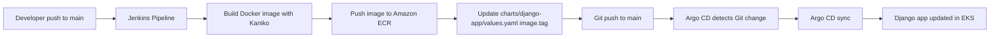

# Lesson 8-9: Jenkins + Terraform + Helm + Argo CD (Full CI/CD)

## Goal
Implement a full GitOps CI/CD flow for a Django application on AWS EKS:
1. Jenkins automatically builds a Docker image.
2. Jenkins pushes the image to Amazon ECR.
3. Jenkins updates `image.tag` in Helm values in Git.
4. Argo CD tracks Git and automatically syncs the application to the cluster.

## What is implemented in this repository
- Terraform modules for: `s3-backend`, `vpc`, `ecr`, `eks`, `jenkins`, `argo_cd`.
- Jenkins is installed via Helm (`modules/jenkins`).
- Argo CD is installed via Helm (`modules/argo_cd`).
- Argo CD Application is created by a dedicated Helm chart (`modules/argo_cd/charts/argo-apps`).
- Jenkins pipeline (`Jenkinsfile`) performs build/push/update-values/git-push.

## CI/CD Diagram


## Prerequisites
- Terraform >= 1.5
- AWS CLI (`aws configure`)
- `kubectl`
- Helm
- GitHub repository for GitOps (this one or a separate repo)

## How to Apply Terraform

### 1. Bootstrap Backend (one-time)
```bash
terraform init -backend=false
terraform apply -target=module.s3_backend -auto-approve
```

### 2. Switch to Remote State
```bash
terraform init -reconfigure -migrate-state
```

### 3. Full Infrastructure Deployment
Before `apply`, update this value in `main.tf`:
- `module.argo_cd.app_repo_url`
	with your real Git URL, for example:
	`https://github.com/<username>/lesson-8-9.git`

Run:
```bash
terraform plan
terraform apply -auto-approve
```

### 4. Configure Cluster Access
```bash
aws eks update-kubeconfig --region us-west-2 --name woolf-goit-eks-usw2
kubectl get nodes
```

## Jenkins: How to Verify the Job

### 1. Get Jenkins URL
```bash
kubectl get svc -n jenkins
```
Service `jenkins` should get an `EXTERNAL-IP` (LoadBalancer).

### 2. Get Admin Password
```bash
kubectl exec -n jenkins svc/jenkins -c jenkins -- cat /run/secrets/additional/chart-admin-password && echo
```

### 3. Create a Pipeline Job
In Jenkins:
1. New Item -> Pipeline.
2. Pipeline script from SCM -> Git.
3. Set repository URL and branch `main`.
4. Script Path: `Jenkinsfile`.

### 4. Create Credentials in Jenkins
Required credentials:
1. `aws-creds` (type: AWS Credentials) for ECR push.
2. `git-token` (type: Secret text) for Git push.

### 5. Verify Successful Build
Build Log should include stages:
1. `Checkout source`
2. `Build and push image to ECR`
3. `Update Helm values and push to main`

After successful job, verify with:
```bash
git log --oneline -n 3
```
The latest commit should include a message like:
`ci: update django image tag to ...`

## Argo CD: How to Verify the Result

### 1. Check Argo CD Resources
```bash
kubectl get pods -n argocd
kubectl get svc -n argocd
```

### 2. Get Initial Admin Password
```bash
kubectl -n argocd get secret argo-cd-argocd-initial-admin-secret -o jsonpath={.data.password} | base64 --decode; echo
```

### 3. Open Argo CD UI
Use `EXTERNAL-IP` of service `argo-cd-argocd-server`.

### 4. Verify Auto-Sync
After Jenkins commits the new tag:
1. Application `django-app` should become `Synced` and `Healthy`.
2. Updated Deployment should appear in namespace `django`.

CLI verification:
```bash
kubectl get applications -n argocd
kubectl get deploy,po,svc,hpa -n django
```

## Important Files
- `Jenkinsfile` - CI pipeline (Kaniko + ECR + update Helm values).
- `modules/jenkins/values.yaml` - Jenkins Helm values + Kubernetes agent config.
- `modules/argo_cd/argo_cd.tf` - Helm install for Argo CD + Argo applications chart.
- `modules/argo_cd/charts/argo-apps/templates/application.yaml` - Argo CD Application manifest template.

